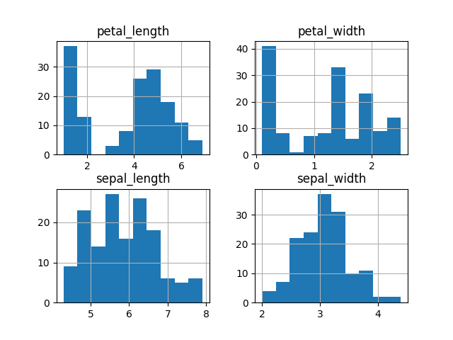
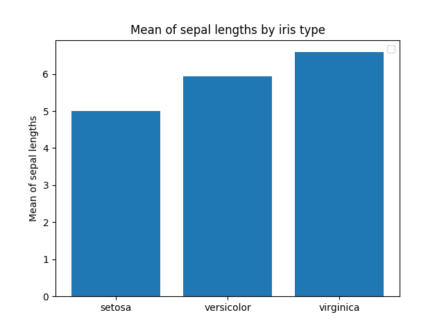
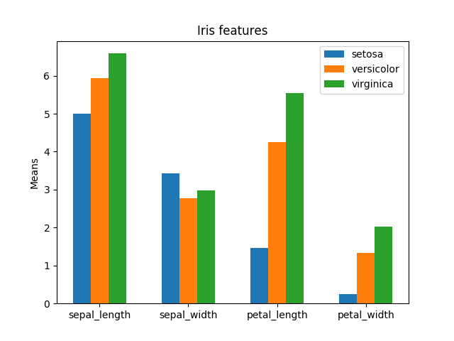

# Jupyter et ses *notebooks*

Les *notebooks* Jupyter sont des "cahiers électroniques" qui peuvent rassembler du texte, des images, des formules mathématiques et du code informatique exécutable. Ils sont manipulables interactivement dans un navigateur web. La cellule est l'élément de base d'un *notebook* Jupyter. Elle peut contenir du texte au format [Markdown](https://www.markdownguide.org/basic-syntax/) ou du code qui pourra être exécuté.

## Préparation de l'environnement

* Créer un environnement virtuel **venv**.

```
$ python3 -m venv venv_3.6
```

* Activer l'environnement virtuel.

```
$ source venv_3.6/bin/activate
```

* Télécharger les dépendances contenues dans le fichier *requirements.txt*.

```
$ pip install -r requirements.txt
```

## Lancement de Jupyter et création d'un *notebook*

* Lancer les *notebooks* Jupyter.

```
$ jupyter-notebook
```

* Créer un nouveau *notebook* sous Python3.
* Renommer le par *tp_python*

## Fouille de données

* Importer les librairies *pandas*, *matplotlib.pyplot* avec l'alias *plt*, *numpy* avec l'alias *np* et la fonction *KMeans* du paquet *sklearn.cluster*.
* Charger les données contenues dans le fichier *dataset.tsv* à partir de la fonction [read_csv](https://pandas.pydata.org/pandas-docs/version/0.25/reference/api/pandas.read_csv.html?highlight=csv#pandas.read_csv) de *pandas*.

```
>>> data = pandas.read_csv("dataset.tsv", sep="\t")
```

* Afficher le nom des colonnes.

```
>>> data.columns.values
```

*  Afficher les premières lignes du tableau.

```
>>> data.head()
```

* Afficher les premières lignes de la colonne *sepal_length*.

```
>>> data["sepal_length"].head()
```

* Afficher les premières données des colonnes *sepal_length*, *sepal_width*, *petal_length*, *petal_width*.

```
>>> data.loc[:, "sepal_length":"petal_width"].head()
```

* Afficher les données de la première ligne.

```
>>> data.iloc[0]
```

* Calculer la moyenne de la colonne *sepal_length*.

```
>>> data["sepal_length"].mean()
```

* Afficher uniquement les lignes en rapport avec le label *setosa*.

```
>>> data[data.label == "setosa"]
```

* Afficher un histogramme comptabilisant le nombre de fois qu'une valeur apparaît pour chaque type de caractéristiques (chaque colonne).

```
>>> data.hist() # plt.show() pour afficher les histogrammes.
```



* Calculer la moyenne de la colonne *sepal_length* pour le label *setosa*.
* Afficher les différents labels avec la fonction *unique()*.
* Calculer la moyenne de la colonne *sepal_length* pour tous les labels.
* Créer un [histogramme](https://matplotlib.org/3.1.1/api/_as_gen/matplotlib.pyplot.bar.html) à partir de matplotlib avec la moyenne des *sepal_length* pour l'ensemble des labels.

```
>>> fig, ax = plt.subplots(nrows=1, ncols=1) # Instancier une figure avec un sous-ensemble de graphiques (contrôler avec la variable "ax").
>>> ax.bar(x, heigth) # x correspond aux coordonnées des abscisses des barres de l'histogramme et height à leur hauteur respective.
>>> x = np.arange(len(labels)) # [0 1 2].
>>> ax.set_xticks(x) # Modifier l'emplacement des tirets de l'axe des abscisses.
>>> ax.set_xticklabels(labels) # Ajouter un label sur chacun des tirets.
>>> ax.set_ylabel('Sepal lengths')
>>> ax.set_title('Sepal lengths by iris type')
>>> plt.show() # Afficher la figure.
```



* Calculer la moyenne des valeurs de chaque colonne pour chaque type d'iris.
* Créer un histogramme permettant d'afficher, pour chaque type d'iris, les moyennes précédemment obtenues.

```
>>> columns = data.columns.values[:-1]
>>> width = 0.20
>>> start = width * (-1)
>>> for i in range(len(labels)):
...		ax.bar(x + start, height[i], width=width, label=labels[i]) # x + start permet de positionner les barres, height[i] associe les hauteurs des barres pour chaque caractéristique de chaque label, width est la largeur des barres et label correspond aux labels des barres.
...		start += width
>>> ax.legend() # Permet d'afficher les labels.
```



* Réaliser un partionnement des données avec la méthodologie du [Kmeans](https://scikit-learn.org/stable/modules/generated/sklearn.cluster.KMeans.html) (n_clusters = 3).

```
clf = KMeans(n_clusters=3, random_state=42)
clf.fit(data.loc[:, "sepal_length":"petal_width"])
pred_labels = clf.labels_
```

* À partir de la fonction suivante déterminer la F1-mesure obtenue avec le KMeans.

```
def evaluation(true_labels, pred_labels):
	TP = FP = FN = TN = 0
	for i in range(len(true_labels)):
		for j in range(i+1, len(true_labels)):
			if pred_labels[i] == pred_labels[j] and true_labels[i] == true_labels[j]:
				TP += 1
			elif pred_labels[i] != pred_labels[j] and true_labels[i] != true_labels[j]:
				TN += 1
			elif pred_labels[i] == pred_labels[j] and true_labels[i] != true_labels[j]:
				FP += 1
			elif pred_labels[i] != pred_labels[j] and true_labels[i] == true_labels[j]:
				FN += 1
	precision = TP / (TP + FP)
	recall = TP / (TP + FN)
	return (2*precision*recall) / (precision+recall)
```

# Auteur

Pierre-Antoine Jean (IMT Mines Alès).

# Références

https://python.sdv.univ-paris-diderot.fr/cours-python.pdf